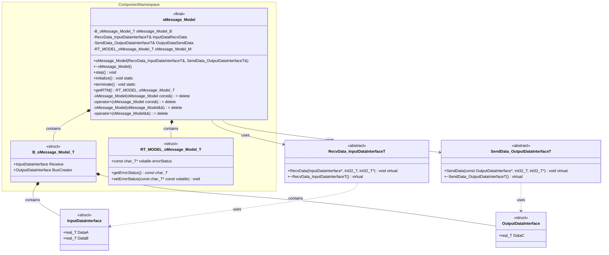

# Class Diagram for oMessage_Model

Based on the C++ code analysis, here's the UML class diagram in Mermaid format:

## Class Description Summary

### Main Classes and Structures:

1. **oMessage_Model** (final class)
   - Main model class within ComponentNamespace
   - Contains message processing logic with step(), initialize(), and terminate() methods
   - Uses dependency injection pattern with RecvData and SendData interfaces
   - Implements RAII and prevents copying/moving

2. **B_oMessage_Model_T** (struct)
   - Block signals structure containing input/output data
   - Holds received data and processed bus creator output

3. **RT_MODEL_oMessage_Model_T** (struct)
   - Real-time model data structure for error handling
   - Manages error status with getter/setter methods

4. **InputDataInterface** (struct)
   - Input data structure with DataA and DataB fields
   - Used for receiving external data

5. **OutputDataInterface** (struct)
   - Output data structure with DataC field
   - Used for sending processed data

6. **RecvData_InputDataInterfaceT** (abstract class)
   - Abstract interface for receiving input data
   - Defines RecvData() virtual method

7. **SendData_OutputDataInterfaceT** (abstract class)
   - Abstract interface for sending output data
   - Defines SendData() virtual method

### Key Design Patterns:
- **Dependency Injection**: Constructor takes interface references
- **Template Method**: Abstract interfaces define data flow contracts
- **RAII**: Constructor/destructor manage resources
- **Immutable Design**: Copy/move operations are deleted
- **Namespace Encapsulation**: ComponentNamespace contains main logic

### Data Flow:
1. Input data received via RecvData_InputDataInterfaceT
2. Processing logic in step() method (conditional computation)
3. Output data sent via SendData_OutputDataInterfaceT

This appears to be generated code from Simulink/MATLAB for real-time embedded systems.